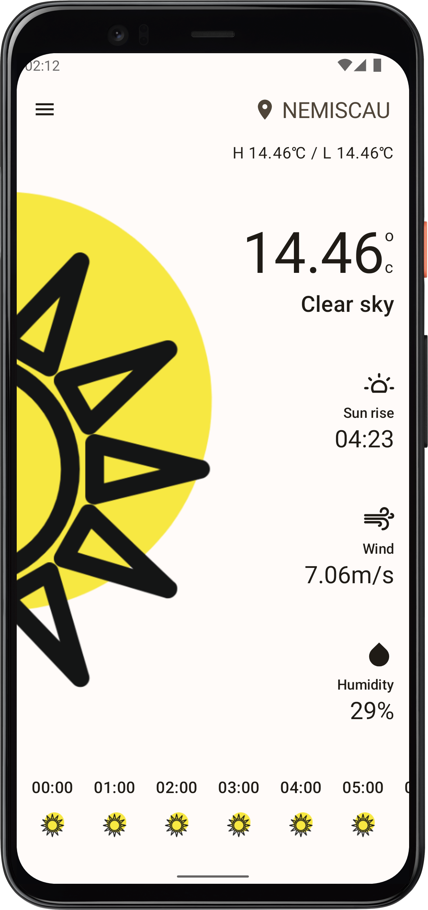
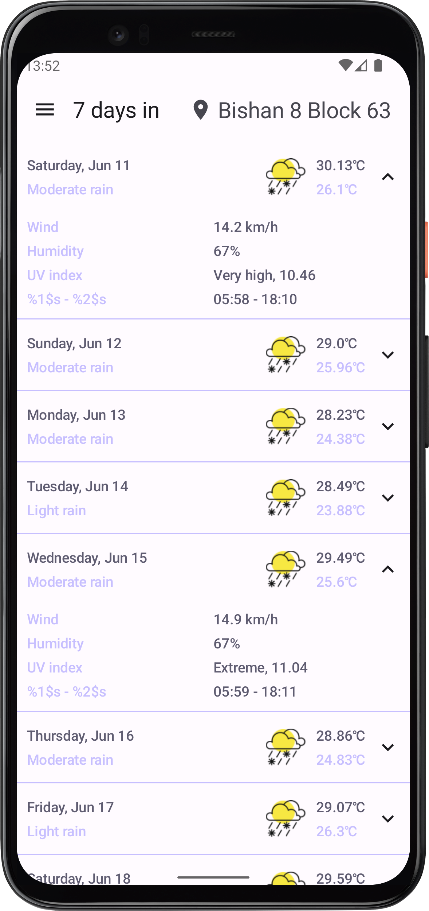
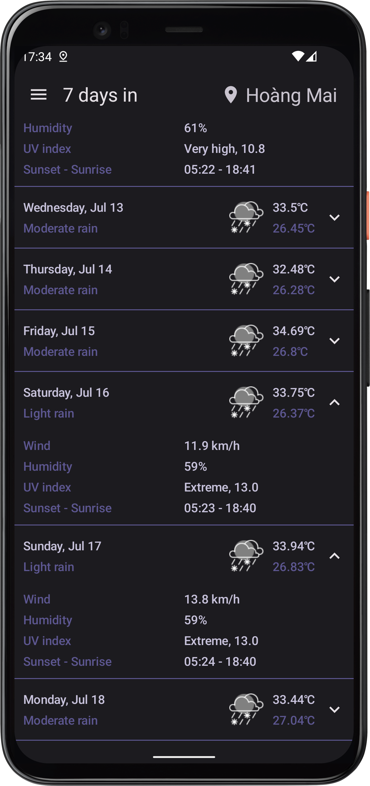
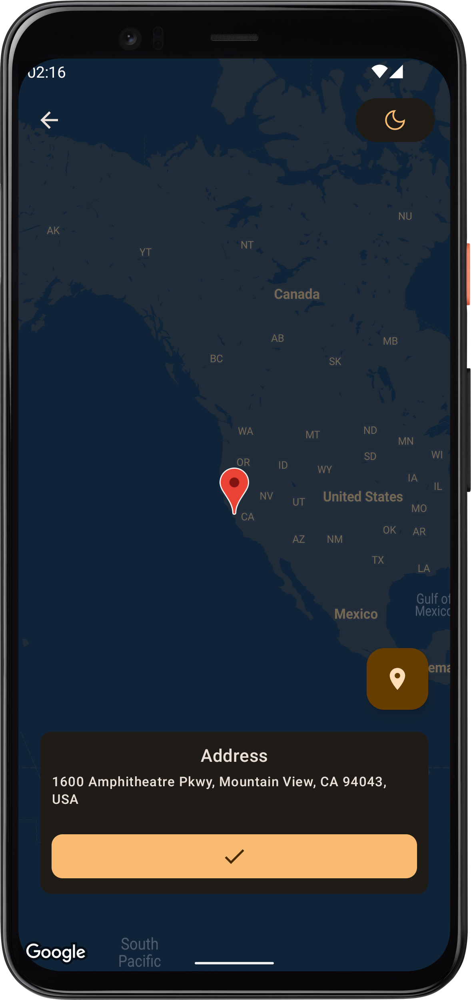
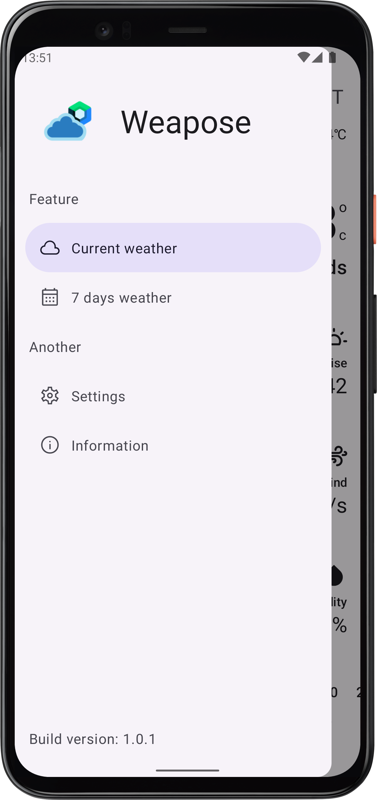
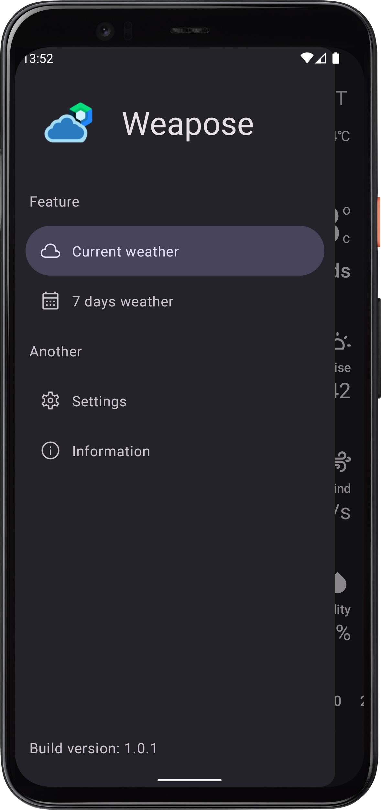
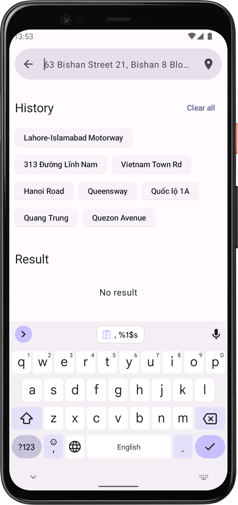
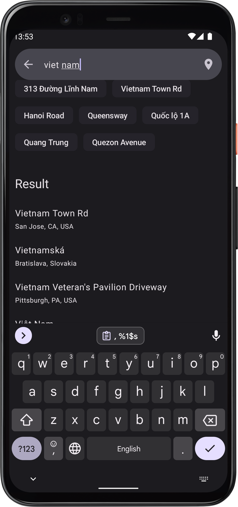
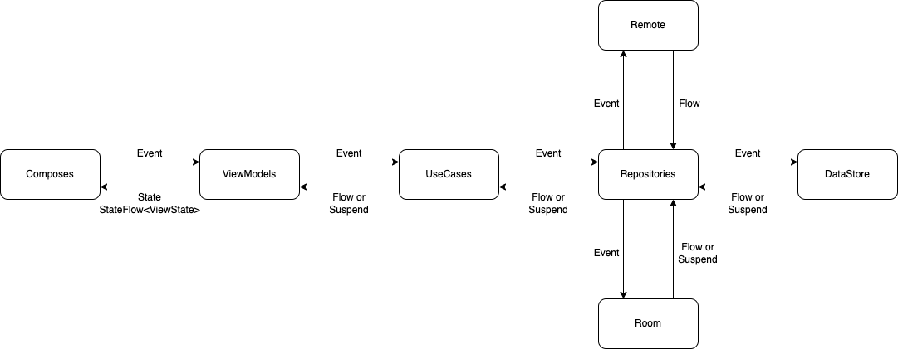
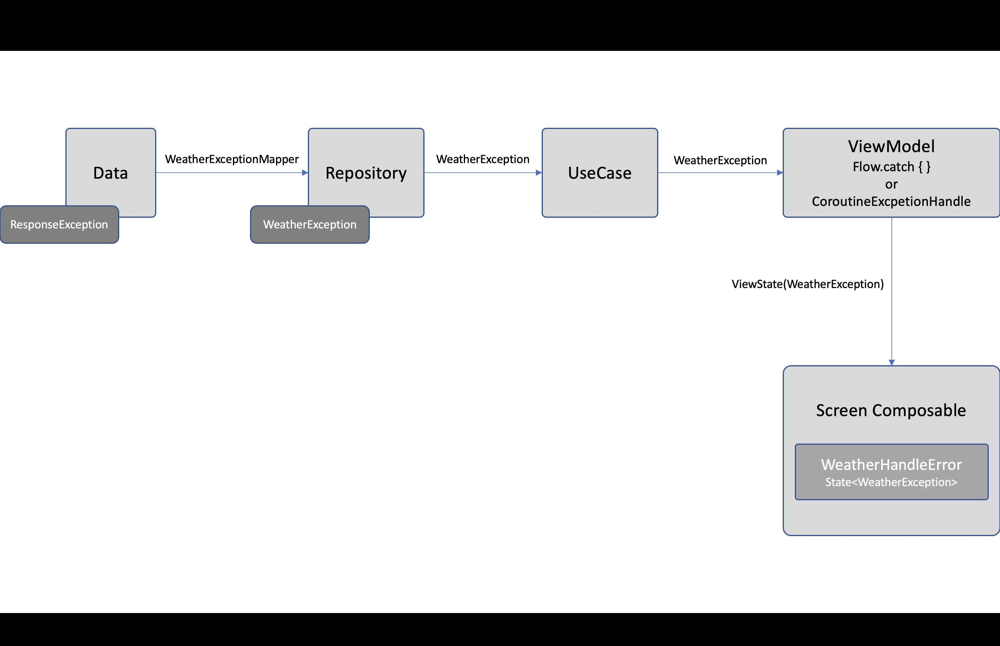

# Weapose - Weather ❤️ Compose

This is an example for show current weather from any location. The **Weapose** is builted by Android Jetpack Compose, MVVM, Clean Architecture, etc.

## :ok_woman: Firstly

This app is inspired by:

- **[Weather app](https://github.com/bachhoan88/MAD-Clean-Architecture) - [bachhoan88](https://github.com/bachhoan88): for solutions and architectures.**
- **[Weather](https://www.uplabs.com/posts/weather-kit) - [Jagan](https://www.uplabs.com/jaganbv): for beautiful design.**

I want to say thanks for those people to help me to make this app.

## :tada: Ready on Google Play

Now, you can download it on Google Play Store. Install it and give me your feedback!

[](https://play.google.com/store/apps/details?id=com.minhdtm.example.weapose&pcampaignid=pcampaignidMKT-Other-global-all-co-prtnr-py-PartBadge-Mar2515-1)

## :hammer: How to build app

- Using the newest version of Android Studio Canary.
- You must add `BASE_URL`, `API_KEY` and `MAPS_API_KEY` inside `local.properties` to build and run Weapose app, like the code below:

    ```kotlin
    BASE_URL=https://api.openweathermap.org/data/2.5/
    API_KEY=API_KEY // Fill your open weather api key in here
    MAPS_API_KEY=GOOGLE_MAPS_API_KEY // Fill your google maps api key in here
    ```

## :camera: Screenshots

| Light mode | Dark mode |
| :---: | :---: |
|  |  |
|  |  |
|  |  |
|  |  |
|  |  |

## :blue_book: Features

- Show the current weather by location or name.
- Show the seven days weather by location or name.
- Choice the location you want by using Google Map.
- Search location by address name by using Google Places.
- Support dark mode.
- Support dynamic material from Android 13 and above.
- Support English and Vietnamese.
- Upcomming ….

## :open_file_folder: Module

Weapose is built according to the Clean Architecture model combined with the MVVM design pattern. To learn more, refer to the links below.

- Guild to app architecture by Google Android.
- Clean architectur by Uncle Bob.

## :mag_right: Unit test

- Using [MockK](https://mockk.io/) to write unit test.
- Using [Kotlin Reflection](https://kotlinlang.org/docs/reflection.html) to access the private method, private property, etc.
- Using [Kotlin Kover](https://github.com/Kotlin/kotlinx-kover) to generate the test coverage. To generate, you just run command ` ./gradlew koverHtmlReport`.

## :tram: Data flow

Weapose is supported by `Flow` and `suspend` for data stream flow in app.



## :x: Error flow

In data module, when data is returned error, I will transform the error to `ResponseException`. And then in domain and presentation, I transform the error from `ResponseException` to `WeatherException` to show the error to UI.



## :bell: Notes

If you have any issues with the project, don't hesitate to create an issue. Also I'm glad you can contribute to my project.

Let's develop together to create quality and beautiful Android Jetpack Compose applications!

## :coffee: Buy me a coffee

Welcome to my github! :wave:

Don't forget to buy me a coffee so that I have more motivation to improve the project! :fire:

[](https://www.buymeacoffee.com/hide.your.code)

## License

```
Copyright 2022 The Android Open Source Project

Licensed under the Apache License, Version 2.0 (the "License");
you may not use this file except in compliance with the License.
You may obtain a copy of the License at

    http://www.apache.org/licenses/LICENSE-2.0

Unless required by applicable law or agreed to in writing, software
distributed under the License is distributed on an "AS IS" BASIS,
WITHOUT WARRANTIES OR CONDITIONS OF ANY KIND, either express or implied.
See the License for the specific language governing permissions and
limitations under the License.
```
